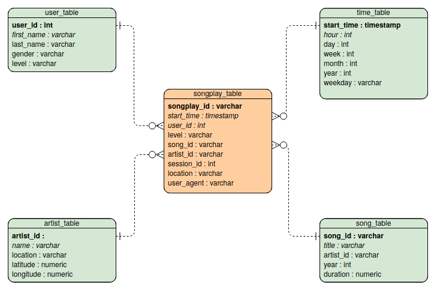

# Project Overview

Data Warehouse project in the Data Engineering Udacity Nanodegree.  

## Introduction

At Sparkify, our app allows the user to stream music. We want to move our processes and data onto the cloud. Our data resides in S3, in a directory of JSON logs on user activities on the app, as well as a directory with JSON metadata on the songs in our app. This repository allows to create an ETL pipeline that 
 - Extracts data from S3
 - Stages them in Redshift
 - Transforms data into a set of dimensional tables
 
 The DB and ETL pipeline can be tested by running the queries of the analytics team, which are stored in the ``` bubu ``` file. Expected results are reported in ```bibi``` for comparison.

## Dataset
Data reside in S3, in a directory of JSON logs on user activity on the app, as well as a directory with JSON metadata on the songs in their app. 

### Song Dataset
Sparkify song dataset (which truely is a subset of the real data from the [Million Song Dataset](http://millionsongdataset.com/)) consists of files in JSON format and contains metadata about a song and the artist of that song. The files are partitioned by the first three letters of each song's track ID. For example, here are filepaths to two files in this dataset.
```python
song_data/A/B/C/TRABCEI128F424C983.json
song_data/A/A/B/TRAABJL12903CDCF1A.json
```
And below is an example of what a single song file, TRAABJL12903CDCF1A.json, looks like.
```python
{"num_songs": 1, "artist_id": "ARJIE2Y1187B994AB7", "artist_latitude": null, "artist_longitude": null, "artist_location": "", "artist_name": "Line Renaud", "song_id": "SOUPIRU12A6D4FA1E1", "title": "Der Kleine Dompfaff", "duration": 152.92036, "year": 0}
```
### Log Dataset
The user activity dataset consists of log files from our music streaming app in JSON format generated by the Sparkify app (Truely: [event simulator](https://github.com/Interana/eventsim)) based on the songs in the dataset above. 

These log files are partitioned by year and month. For example, here are filepaths to two files in this dataset.
```python
log_data/2018/11/2018-11-12-events.json
log_data/2018/11/2018-11-13-events.json
```
And below is an example of what the data in a log file, 2018-11-12-events.json, looks like.


## Files 
In addition to the data files, there are six files:
1. ```test.ipynb``` displays the first few rows of each table to check the database.
2. ```create_tables.py``` drops and creates the tables. It is used to reset the tables before running the ETL scripts.
3. ```etl.ipynb``` reads and processes a single file from ```song_data``` and ```log_data``` and loads the data into the tables. This notebook contains detailed instructions on the ETL process for each of the tables.
4. ```etl.py``` reads and processes files from ```song_data``` and ```log_data``` and loads them into the tables. It can be filled out based on the ETL notebook.
5. ```sql_queries.py``` contains all the sql queries, and is imported into the last three files above.
6. ```README.md``` this readme.


## Database Schema
The Database schema contains the following tables
#### Fact Table 
1. **songplays** - records in log data associated with song plays i.e. records with page ```NextSong```
* *songplay_id, start_time, user_id, level, song_id, artist_id, session_id, location, user_agent*
#### Dimenson Tables
2. **users** - users in the app 
* *user_id, first_name, last_name, gender, level*
3. **songs** - songs in music database
* *song_id, title, artist_id, year, duration
4. **artists** - artists in music database
* *artist_id, name, location, latitude, longitude*
5. **time** - timestamps of records in **songplays** broken down into specific units
* *start_time, hour, day, week, month, year, weekday
It is organised as a start schema, that simplifies queries about user activities. The Entity Relation Diagram is as follows


The diagram is generated using [Visual Paradigm](https://online.visual-paradigm.com/diagrams/features/erd-tool/). Primary keys are in bold font. I did not manage to do-undo italics to distinguish numerical entries...

In addition to the tables of the star schema, the DB contains two staging tables, ```stating_songs``` and ```staging_events```. These tables are used only as a vehicle for processing data results, and are emptied and reloaded each time without persisting in the results from one execution to the next. They are not used for permanent storage. They allow to use the DB engine rather than the DBMS for operations like sorting or aggregation, which are then more efficient.


## Create the tables

<!--- 

## ETL Pipeline
The ETL Pipeline is executed by running the ```etl.py``` file. It transfers data from files in two local directories into these tables in Postgres using Python and SQL. This is done by executing two similar functions, ```process_log_file``` and ```process_song_file```. The PostgreSQL queries for creating and inserting data are written out in the ```sql_queries.py``` file.

### Process Song
This function is applied to each ```.json``` file representing an element of our song dataset.
1. Read the file as pandas dataframe
2. Extract song data and insert them into the user_table

### Process Log
This function is applied to each ```.json``` file representing the activity on the app.
1. Read the file as a pandas dataframe
2. Filter by NextSong
3. Convert timestamp column to datetime format 
4. Split datetime to hour, day, week, month, year, weekday
5. Extract user data and insert them into the user_table
6. Extract songplay records (by querying the song_table and artist_table) and insert them into the songplay_table
-->

## Usage
### Creating the tables
To create the tables, run ```create_tables.py```. This script requires the file ```dwh.cfg``` to be filled in with the following information about the cluster
CLUSTER:
 - HOST
 - DB_NAME
 - DB_USER
 - DB_PASSWORD
 - DB_PORT
IAM ROLE:
 - ARN
<!--2. Run ```etl.py``` process the data and insert them into the database.
### Queries
Example queries for each of the tables can be found in the ```test.ipynb``` file. As additional example, here's a query for checking on which day of the week a specific song, displayed by title, was played
```
SELECT  s.title, t.weekday 
FROM songplay_table AS sp JOIN song_table AS s ON sp.song_id=s.song_id
                        JOIN time_table AS t ON sp.start_time=t.start_time
```
This should return 
| title         | weekday       |
| ------------- |:-------------:| 
| Setanta matins|2              |


-->